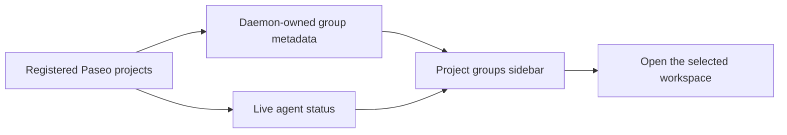

<div align="center">


# Paseo Project Groups


[Features](#features) · [Getting started](#getting-started) · [Compatibility](#compatibility) · [Reference](docs/REFERENCE.md)

</div>

Organize Paseo projects into named groups and see their live agent status at a glance. Groups are metadata: project directories stay exactly where they are.

## Features

| Feature | What you get |
| --- | --- |
| Named groups | Create, rename, and remove project groups |
| Flexible placement | Move projects between groups or back to Ungrouped |
| Custom identities | Emoji, image URLs, or a group-name initial |
| Live status | Working, needs input, completed, and failed states on project/group icons |
| Workspace opening | Select a project to open its workspace or create a local workspace |
| Shared metadata | Desktop, web, and mobile clients read the same daemon-owned groups |

## How it fits



## Getting started

This is a **legacy Paseo 0.7.x plugin**. It uses the earlier single-entry plugin API and needs migration before use with current split-entry runtimes.

```bash
git clone https://github.com/papag00se/paseo-project-groups.git
cd paseo-project-groups
npm install
npm run typecheck
paseo plugin install "$PWD"
```

On a compatible host with plugins enabled, choose **Project groups** in the sidebar, create a group, and assign projects to it.

## Compatibility

The plugin creates a separate grouped surface; it does not rearrange Paseo's built-in Projects sidebar. Metadata is stored atomically on the daemon at `$PASEO_HOME/plugin-data/project-groups.json` and includes only project IDs, group names, and icon references.

For the native sidebar implementation, see the [Paseo fork](https://github.com/papag00se/paseo/tree/feature/project-groups). The plugin and native fork are separate implementations.

## Development

```bash
npm run typecheck
paseo plugin reload project-groups
```

[Storage, status indicators, and installation details →](docs/REFERENCE.md)
